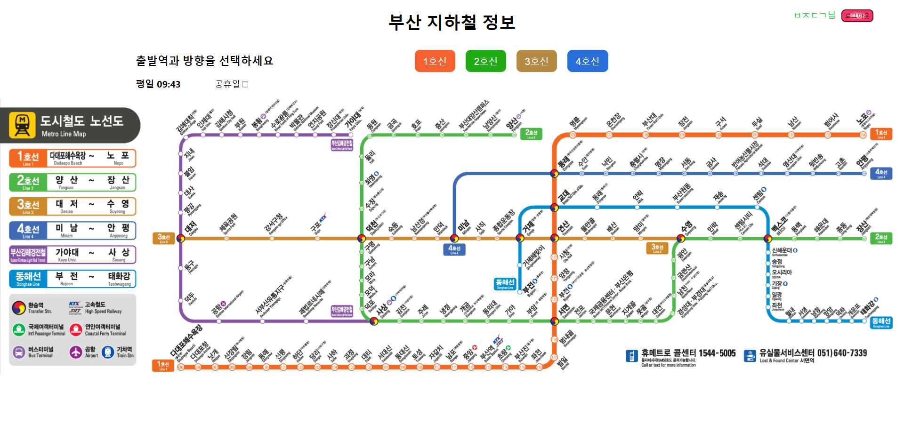
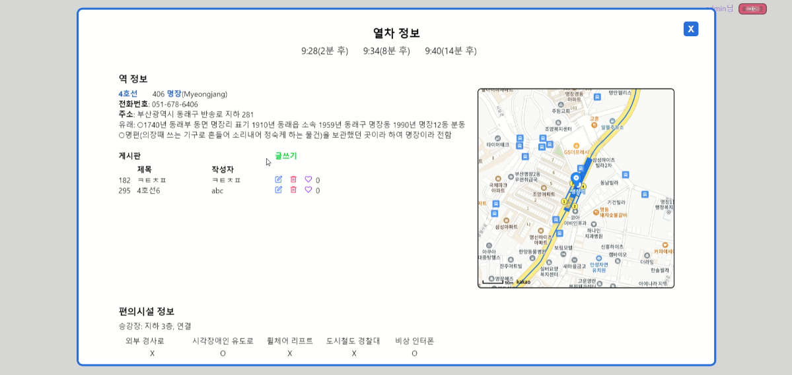
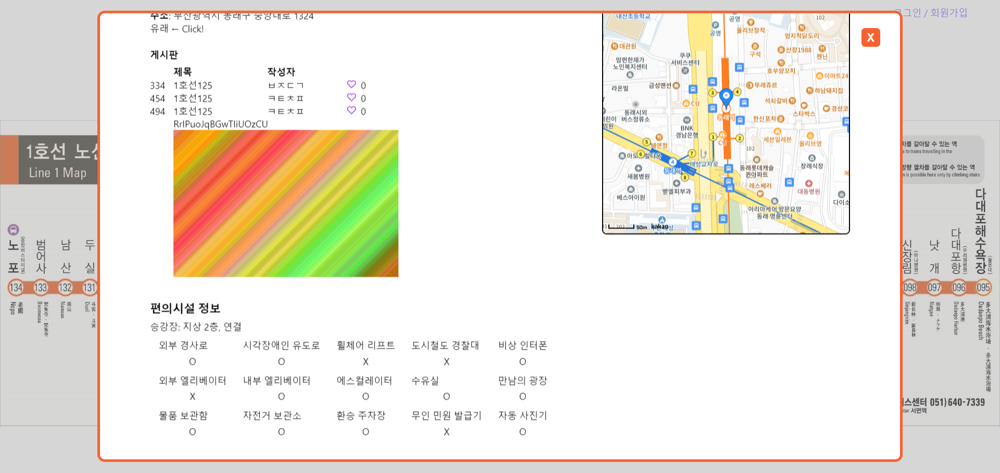
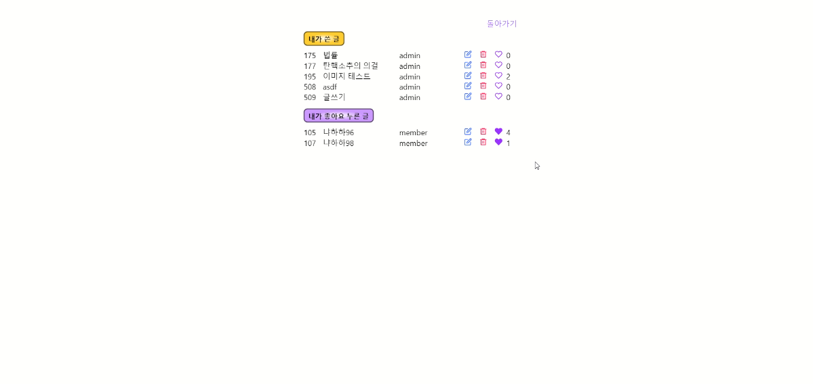

# 부산 지하철 이용 정보 
## 운행 정보
- 열차 도착 시각
## 역 정보
- 영문 이름
- 전화 번호
- 주소
- 유래
- 게시판(이미지 첨부, 좋아요, 권한에 따른 수정, 삭제)
### 편의시설 정보
- <strong>승강장 정보</strong>(지상/지하 층, 승강장 연결)
## 내 정보
내가 쓴 글, 내가 좋아요한 글
## 실행 방법
backend: https://github.com/MyStraw/miniproject  
~~~
npm update
npm start
~~~
subway 폴더에 .env 파일 생성
~~~
REACT_APP_KAKAOMAP_APIKEY=카카오맵 API 키
REACT_APP_BASEURL=backend 주소
~~~
| 메인 화면 |
|-----------|
||

| 역 정보 |
|---------|
||
||

| 내 정보 |
|---------|
||
